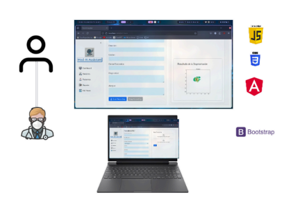
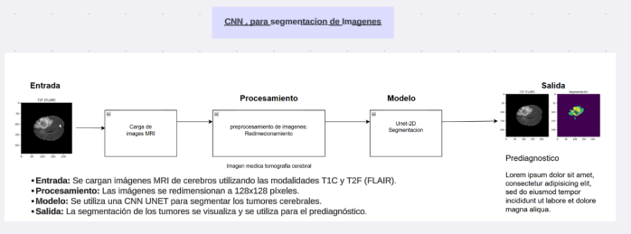
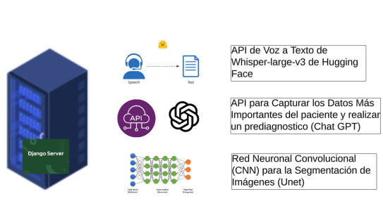
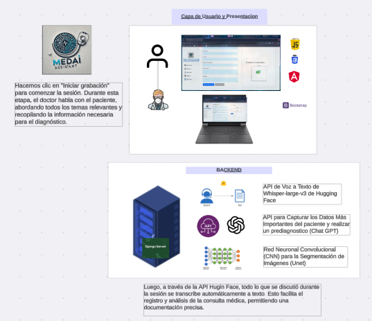
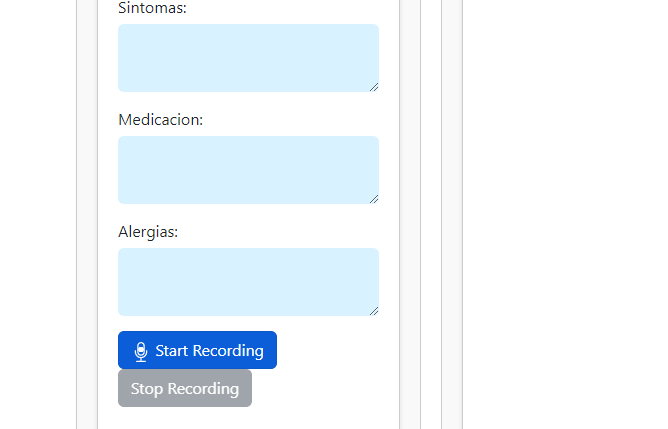
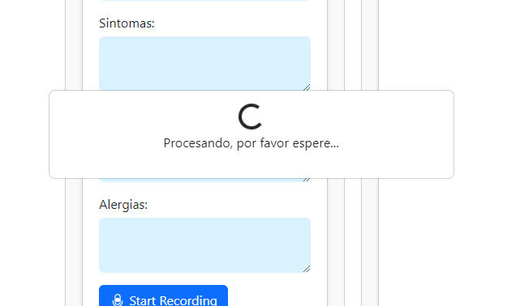
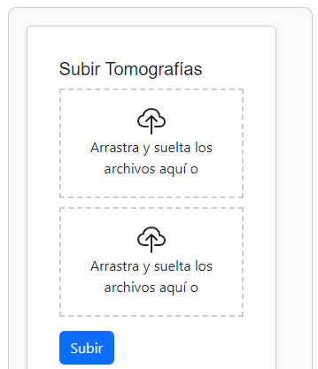
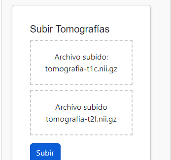
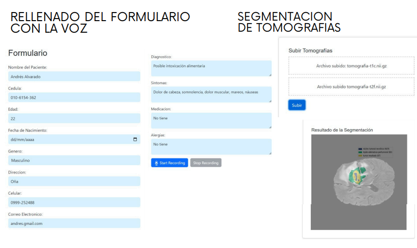

# Med-AI Assistans
La medicina del futuro, hoy contigo

## Indice

-  [Descripción](#descripcion)
-  [Funcionalidades Principales](#funcionalidadesPrincipales)
-  [Propuestas](#propuestas)
-  [Instalación](#instalacion)
-  [Uso](#uso)
-  [Resultados](#resultados)

## Descripción

Pagina web con servicios de IA enfocados en la medicina, esta pagina ayuda para la gestion de medicos y paciente, ademas de eficacia en el rellenado de formularios con voz y realizar segmentacion de tomograficas para la deteccion tumores en el cerebro.

## Funcionalidades Principales

### Interdaz de Usuario

La interfaz de usuario está construida utilizando
tecnologías modernas como JavaScript, Angular y
Bootstrap, proporcionando una experiencia de usuario
fluida y accesible desde diferentes dispositivos.
Interacción con el Paciente: El médico inicia la sesión de
grabación haciendo clic en "iniciar grabación". Durante la
sesión, el médico conversa con el paciente, abordando
todos los temas relevantes y recopilando la información
necesaria para el diagnóstico.

### Procesamiento de Imágenes con Redes Neuronales Convolucionales (CNN)

Segmentación de Imágenes: Utiliza una CNN UNET para segmentar imágenes MRI cerebrales. La
segmentación permite identificar y visualizar tumores cerebrales para facilitar el prediagnóstico.
Entrada: Carga de imágenes MRI con modalidades T1C y T2F (FLAIR).
Procesamiento: Redimensionamiento de las imágenes a 128x128 píxeles.
Modelo: UNET 2D para la segmentación.
Salida: Visualización de la segmentación y prediagnóstico.

### Conversion de Voz a texto

API de Voz a Texto de Openai-Whisper comsumida desde Hugging Face. Transcribe automáticamente todo lo discutido durante la
sesión a texto. Esto facilita el registro y análisis de la consulta médica.

### Capturar Datos Importantes del Paciente y prediagnostico

La API de ChatGPT extrae y organiza los datos más relevantes de la transcripción para un análisis más eficiente.

## Propuestas

## Instalación

- Primero clonamos el repositorio del frontend y del backend

    git clone 

    url del repositorio del backend 
    
    https://github.com/juandtap/MedAiBackend    

- Luego abrimos e instalamos las dependencias

    npm install

- Ahora ejecutamos el siguiente codigo para ejecutar el servidor

    ng serve --open

## Uso

### Rellenado de formulario con la voz 

- Iniciamos el servidor backend y frontend
- Accedemos a la pagina y vamos a la seccion del formulario hl7
 
 

- hacemos click en el boton start recording y empieza a grabar (hay que habilitar el microfono en el navegador)

- hablamos y despues de eso hacemos click en el boton stop recording para que empiece a procesar

- despues del procesamiento se rellenara y en los resultados esta la imagen de como queda 

### Rellenado de formulario con la voz

- Iniciamos el servidor backend y frontend
- Accedemos a la pagina y vamos a la seccion del formulario hl7 y en la parte derecha estan los input para subir las tomografias

- Subimos dos tomografias y damos click en subir para que empiece el procesamiento de las imagenes

- En los resultados esta la imagen de como queda 

## Resultados

