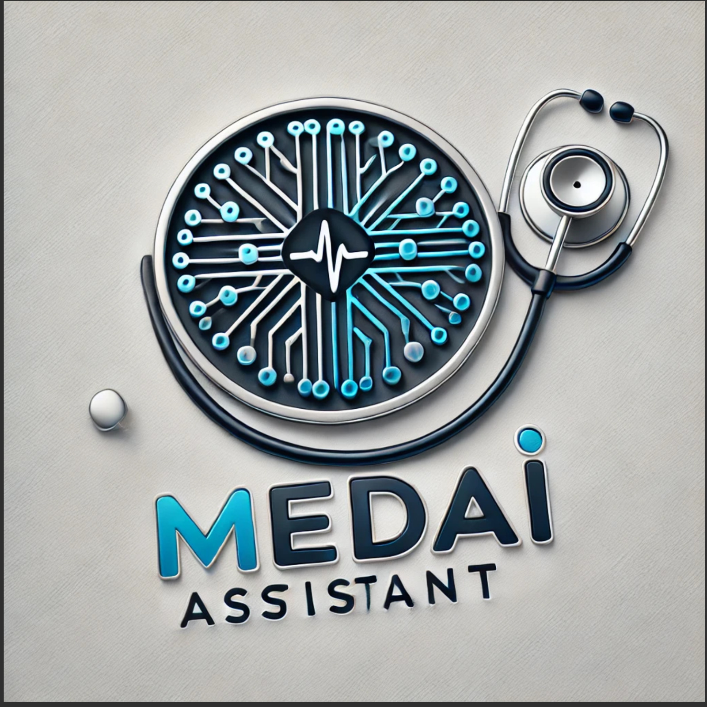

# Med-AI Assistans
La medicina del futuro, hoy contigo

Pagina web con servicios de IA enfocados en la medicina, esta pagina ayuda para la gestion de medicos y paciente, ademas de eficacia en el rellenado de formularios con voz y realizar segmentacion de tomograficas para la deteccion tumores en el cerebro.

## Indice

-  [Problematica](#problematica)
-  [Introducción](#introduccion)
-  [Fundamentos Teoricos](#fundamentosTeoricos)
-  [Propuestas](#propuestas)
-  [Resultados](#resultados)
-  [Instalación](#instalacion)
-  [Contacto](#contacto)

## Problematica

El cáncer cerebral en Ecuador enfrenta grandes desafíos debido a la falta de acceso a tecnologías avanzadas y servicios de salud especializados, especialmente en zonas rurales. Los altos costos de tratamiento y la escasez de recursos médicos agravan la situación. Además, la falta de concienciación sobre los síntomas, las limitaciones en la segmentación de imágenes y los errores en el tedioso proceso de rellenar formularios dificultan la detección y el diagnóstico precisos. Mejorar el acceso a diagnósticos, tratamientos y la educación pública, así como implementar tecnologías avanzadas, es crucial para abordar este problema.

## Introduccion

## Fundamentos Teoricos

## Propuestas

## Resultados
